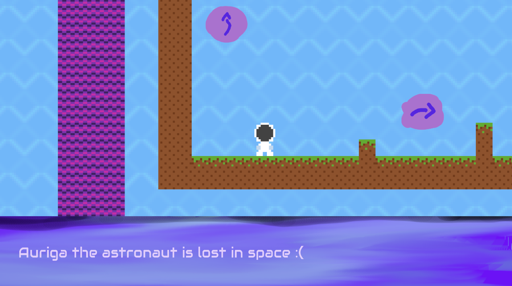

# Auriga

Author: Matei Budiu

Design: This is a game that provides lore for the other games I have made for this class. It's a point and click story game.

Text Drawing: I used Harfbuzz to pre-render the text to a texture atlas and output widths of characters, and then create a VAO for each character, and display them accordingly.

Choices: There are some data structures in the code which link to each other - areas define backdrops, interactables are keys, and doors can require keys
to be used. In the end, everything is configured in the constructor of playmode making it easy to write, but not data-driven.

Screen Shot:

How To Play:

Click the screen to advance text or interact with the world.

Sources:

https://fonts.google.com/specimen/Audiowide?sort=popularity - open font license

This game was built with [NEST](NEST.md).

